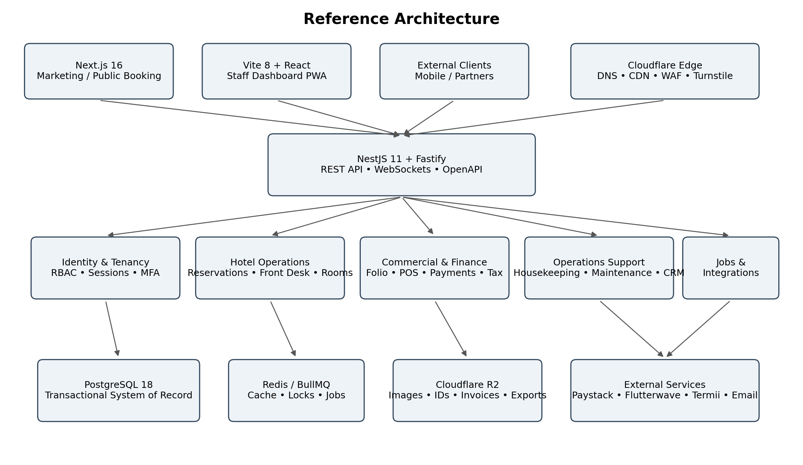
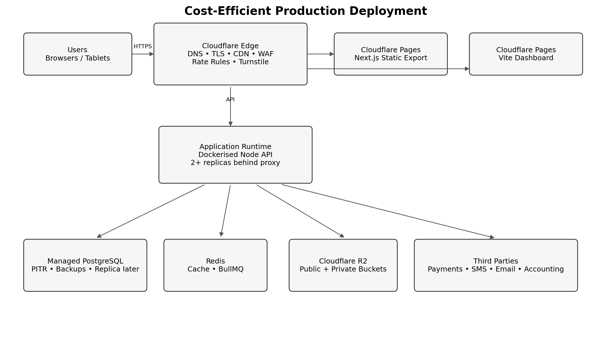
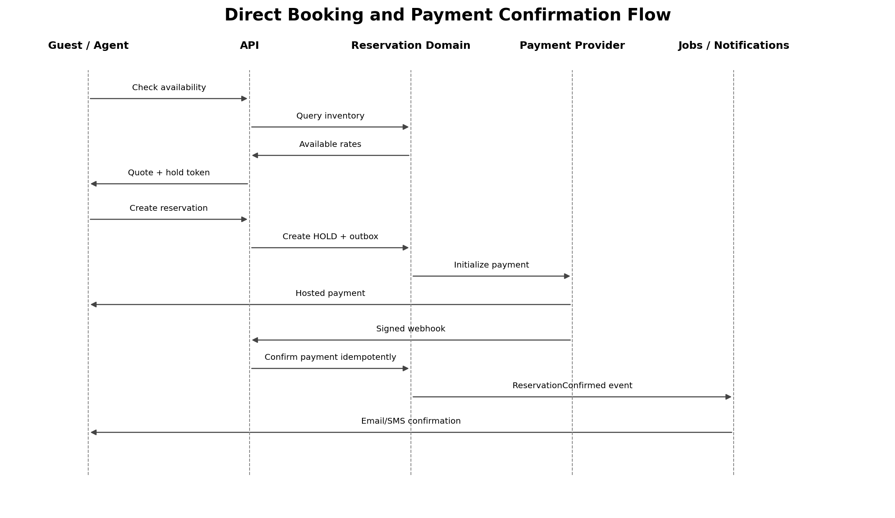

# Nigerian Hotel Management System

**Enterprise Technical Specification**

Implementation-ready blueprint for a cost-efficient multi-tenant SaaS

**Architecture baseline**

Next.js marketing site • Vite dashboard PWA • Node.js/NestJS API • PostgreSQL • Redis/BullMQ • Cloudflare R2

*Prepared for product, engineering, QA, DevOps, and Codex-assisted implementation*

Version 1.0 — 28 July 2026

# Document Control

| **Field**                | **Value**                                                                                                                                                                                 |
|--------------------------|-------------------------------------------------------------------------------------------------------------------------------------------------------------------------------------------|
| Document purpose         | Define the complete technical architecture, domain model, APIs, security model, delivery plan, and Codex execution instructions for an enterprise-quality Nigerian hotel management SaaS. |
| Primary audience         | Founder, CTO, software engineers, QA engineers, DevOps engineers, product designers, implementation consultants, and AI coding agents.                                                    |
| Architecture style       | Multi-tenant modular monolith with event-driven internal boundaries and a planned extraction path for high-scale services.                                                                |
| Primary deployment       | Cloud SaaS; shared tenancy by default; single-tenant deployment available later for enterprise customers.                                                                                 |
| Technology baseline date | 28 July 2026.                                                                                                                                                                             |
| Change policy            | Architecture Decision Records (ADRs) are mandatory for changes to tenancy, financial ledgers, security, offline synchronisation, storage, or integration contracts.                       |

> Core recommendation: build a modular monolith first. Do not begin with microservices. Strong module boundaries, an outbox, queues, and versioned contracts provide enterprise discipline without unnecessary infrastructure cost.

# Table of Contents

1\. Executive Summary

2\. Product Scope and Quality Attributes

3\. Technology Stack and Architecture Decisions

4\. System Context and Deployment Topology

5\. Monorepo and Codebase Structure

6\. Multi-Tenancy, Identity, RBAC, and Property Scope

7\. Domain Modules and Business Rules

8\. Database and Data Architecture

9\. API, Events, WebSockets, and Integration Contracts

10\. Offline-First Dashboard Architecture

11\. Cloudflare R2 Object Storage Architecture

12\. Security, Privacy, Compliance, and Auditability

13\. Payments, Tax, Reconciliation, and Financial Controls

14\. Reporting, Analytics, and AI Readiness

15\. DevOps, Environments, CI/CD, Observability, and Disaster Recovery

16\. Testing and Quality Strategy

17\. Implementation Roadmap and Acceptance Gates

18\. Codex Master Build Prompt

19\. Phased Codex Prompts

20\. Appendices and References

# 1. Executive Summary

This specification defines a production-grade hotel management platform designed for Nigerian independent hotels, boutique properties, serviced apartments, and hotel groups. The system is built as a multi-tenant SaaS that prioritises operational control, revenue protection, payment reconciliation, low-bandwidth resilience, local tax configuration, and straightforward staff workflows.

The platform is split into three user-facing applications and one backend platform:

- A Next.js 16 application for the product landing site, documentation, public hotel pages, and optional direct-booking pages. The first release should use static generation or static export wherever possible.

- A Vite 8 + React application for the authenticated hotel dashboard. It is an installable Progressive Web App (PWA) with offline-safe workflows for front desk and housekeeping.

- A Node.js 24 LTS backend using NestJS 11 with the Fastify adapter. It exposes REST APIs, WebSocket channels, webhook endpoints, and background jobs.

- A PostgreSQL 18 transactional database, Redis/BullMQ for caching and jobs, and Cloudflare R2 for object storage.

The initial backend is a modular monolith. Hotel operations are highly transactional: reservations, folio postings, room allocations, payment confirmations, cashier shifts, night audit, and inventory movements must remain consistent. Keeping these modules in one deployable application enables database transactions and simpler operations. Internal domain events and the transactional outbox preserve a future path to service extraction.



*Figure 1. Reference architecture for the hotel management platform.*

## 1.1 Primary business outcomes

| **Outcome**                        | **System capability**                                                                                                                            |
|------------------------------------|--------------------------------------------------------------------------------------------------------------------------------------------------|
| Prevent revenue leakage            | Immutable audit trail; approval controls; folio ledger; cashier shift reconciliation; night audit; no direct deletion of financial transactions. |
| Reduce front-desk delays           | Fast room rack, reservation search, reusable guest records, direct payment confirmation, responsive design, and offline-safe operations.         |
| Improve owner visibility           | Daily flash report, occupancy, ADR, RevPAR, outstanding balances, discounts, voids, payment mismatches, and property comparisons.                |
| Support Nigerian payment behaviour | Card, bank transfer, payment link, cash, POS-terminal reference, Paystack/Flutterwave webhooks, and manual verification with approval.           |
| Lower technology cost              | Static frontend hosting, modular monolith, Cloudflare R2, managed PostgreSQL, one Redis service, and containerised deployment.                   |
| Create enterprise upgrade paths    | Multi-property hierarchy, SSO, API integrations, private tenancy, advanced reporting, and event-driven service extraction.                       |

# 2. Product Scope and Quality Attributes

## 2.1 MVP scope

- Tenant and property onboarding, room types, rooms, amenities, rate plans, taxes, service charges, policies, and staff invitations.

- Reservation calendar, walk-ins, direct reservations, availability search, room allocation, modifications, cancellation, no-show, and group booking foundations.

- Guest profiles, identity document metadata, visit history, preferences, notes, communication consent, and duplicate detection.

- Check-in, room move, stay extension, early departure, late checkout, checkout, folios, split folios, postings, deposits, refunds, and receipts.

- Cashier shifts, payment capture, gateway webhooks, bank-transfer reconciliation, end-of-shift balancing, and night audit.

- Housekeeping room board, cleaning tasks, inspections, linen notes, maintenance tickets, and out-of-order/out-of-service room handling.

- Restaurant/bar POS foundation, outlet setup, menu items, order posting to a guest folio, cash/card/transfer settlement, and shift close.

- Role-based dashboards, audit log, approvals, reports, CSV/PDF exports, email/SMS notifications, and R2 document storage.

- SaaS subscription and plan controls sufficient to activate, suspend, and limit tenants without building a full billing marketplace.

## 2.2 Explicit non-goals for first release

- Direct certification with Booking.com, Expedia, or every OTA. Integrate through one channel-manager partner after the core PMS is stable.

- Full general ledger, payroll, or statutory accounting suite. Provide journals, exports, and integration hooks instead.

- Native iOS/Android applications. Build a high-quality PWA first.

- Microservices, Kubernetes, multi-region active-active infrastructure, or a data warehouse before product-market fit.

- AI-based autonomous pricing in the MVP. Capture clean data first, then add decision support with human approval.

## 2.3 Quality attributes

| **Attribute**   | **Target / design rule**                                                                                                                                                                      |
|-----------------|-----------------------------------------------------------------------------------------------------------------------------------------------------------------------------------------------|
| Availability    | Pilot target 99.5%; commercial target 99.9%. Critical front-desk read views remain available from local cache during connectivity loss.                                                       |
| Performance     | P95 API response under 400 ms for normal transactional calls in-region; room rack under 1.5 seconds for 200 rooms; dashboard first usable content under 3 seconds on typical 4G.              |
| Scalability     | Start at 10 properties and scale to 10,000 using stateless APIs, tenant-aware indexing, queue workers, read replicas, table partitioning, and service extraction only where proven necessary. |
| Security        | Least privilege, MFA for privileged roles, encrypted transport, protected secrets, signed webhooks, append-only audit events, tenant isolation tests, OWASP ASVS-aligned controls.            |
| Data integrity  | Financial and inventory records are ledger-based. Posted records are reversed, not edited or deleted.                                                                                         |
| Maintainability | Module boundaries, typed contracts, automated tests, code owners, ADRs, migration discipline, feature flags, and backward-compatible APIs.                                                    |
| Usability       | Role-specific navigation; keyboard-friendly front desk; mobile-first housekeeping; clear error recovery; no hidden financial side effects.                                                    |
| Cost efficiency | Static sites on Cloudflare Pages, one Node API deployment, one job worker, managed PostgreSQL, Redis, and R2. Avoid paid search, Kafka, and Kubernetes initially.                             |

# 3. Technology Stack and Architecture Decisions

## 3.1 Version baseline

| **Layer**            | **Recommended baseline**                               | **Reason**                                                                                                   |
|----------------------|--------------------------------------------------------|--------------------------------------------------------------------------------------------------------------|
| Runtime              | Node.js 24 LTS                                         | Production applications should use an LTS line. Node 24 is LTS as of the baseline date.                      |
| Package manager      | pnpm workspaces; pin packageManager in package.json    | Fast, disk-efficient monorepo installs and deterministic lockfile.                                           |
| Monorepo             | Turborepo                                              | Task graph, remote/local cache, clear app/package boundaries.                                                |
| Marketing/public web | Next.js 16.2 App Router + React 19                     | SEO, static generation, metadata, public pages, and a future direct-booking surface.                         |
| Dashboard            | Vite 8 + React 19 + React Router + TanStack Query      | Fast build system, static deployment, strong SPA/PWA fit, and separation from backend.                       |
| Backend              | NestJS 11 + Fastify + TypeScript                       | Modular architecture, dependency injection, OpenAPI, WebSockets, and efficient HTTP runtime.                 |
| Database             | PostgreSQL 18                                          | Strong transactions, constraints, JSONB, row security, full-text search, range types, and mature operations. |
| ORM                  | Prisma (current stable compatible with Node 24)        | Developer productivity and migrations; wrapped behind repositories and tenant guards.                        |
| Cache/jobs           | Redis-compatible service + BullMQ                      | Caching, distributed locks, rate-limit state, delayed jobs, retries, and job dashboards.                     |
| Object storage       | Cloudflare R2 via AWS S3 SDK v3                        | S3-compatible API, presigned URLs, low storage cost, and no internet egress charge from R2.                  |
| Validation/contracts | Zod + OpenAPI-generated client types                   | Single source for runtime validation and typed front-end contracts.                                          |
| Testing              | Vitest/Jest, Supertest, Testcontainers, Playwright, k6 | Unit, integration, E2E, browser, and load testing.                                                           |

> Version rule: major versions in this document are architectural baselines. At scaffolding time, install the latest patched release within each approved major and commit the pnpm lockfile. Never use floating versions in production images.

## 3.2 Key Architecture Decision Records

| **ADR** | **Decision**                                         | **Rationale**                                                                                                                     |
|---------|------------------------------------------------------|-----------------------------------------------------------------------------------------------------------------------------------|
| ADR-001 | Use a modular monolith for the API                   | Preserves transactions and lowers operating complexity. Modules communicate through application services and domain events.       |
| ADR-002 | Use shared-schema multi-tenancy with tenant_id       | Lowest cost and simplest analytics. Enforce isolation in JWT context, repositories, composite indexes, tests, and PostgreSQL RLS. |
| ADR-003 | Use Vite for the authenticated dashboard             | The staff system is a highly interactive API client and PWA; it does not need server-side rendering.                              |
| ADR-004 | Use Next.js primarily for public pages               | Public pages benefit from static generation, metadata, and server rendering where needed.                                         |
| ADR-005 | Use REST first; WebSockets for live boards           | REST is easier to secure, document, cache, and integrate. GraphQL is deferred until a proven use case exists.                     |
| ADR-006 | Use a ledger model for financial and stock movements | Prevents silent changes and provides an auditable history. Corrections are reversals.                                             |
| ADR-007 | Use an outbox and BullMQ for asynchronous work       | Guarantees domain events are not lost between database commits and queue publication.                                             |
| ADR-008 | Use R2 direct uploads with short-lived signed access | Reduces API bandwidth and keeps credentials private. Private objects are never public by default.                                 |
| ADR-009 | Use UTC timestamps plus property business date       | Hotel operations need a distinct business date controlled by night audit, while system timestamps remain UTC.                     |
| ADR-010 | No Kubernetes before scale justifies it              | Docker, health checks, managed database, and rolling deployments are sufficient for early growth.                                 |

# 4. System Context and Deployment Topology

## 4.1 Public domains

| **Domain**         | **Application**               | **Notes**                                                                                                          |
|--------------------|-------------------------------|--------------------------------------------------------------------------------------------------------------------|
| www.example.com    | Next.js marketing/public site | Static export to Cloudflare Pages for the first release. Use SSR only when public booking requirements justify it. |
| app.example.com    | Vite dashboard PWA            | Cloudflare Pages. Authenticated staff application.                                                                 |
| api.example.com    | NestJS API                    | Cloudflare proxied DNS to the application runtime. Disable caching for authenticated APIs.                         |
| files.example.com  | Public R2 custom domain       | Only public hotel assets. Private IDs, invoices, and exports use signed URLs from private bucket.                  |
| status.example.com | Status page                   | Use a simple independent status provider or static page.                                                           |



*Figure 2. Recommended production deployment topology.*

## 4.2 Initial production sizing

| **Component** | **Pilot sizing**                                                       | **Growth trigger**                                                                         |
|---------------|------------------------------------------------------------------------|--------------------------------------------------------------------------------------------|
| API runtime   | 2 vCPU, 4 GB RAM; one instance for pilot, two replicas before paid SLA | CPU \> 60% sustained, memory \> 70%, or P95 latency exceeds target.                        |
| Worker        | 1 vCPU, 2 GB RAM                                                       | Queue lag above 60 seconds or long-running report jobs block notifications.                |
| PostgreSQL    | Managed 2 vCPU / 4–8 GB with automated backups and connection pooling  | Active connections, IOPS, cache hit rate, dataset size, or report contention.              |
| Redis         | 512 MB–1 GB managed                                                    | Eviction, queue growth, or rate-limit keys exceed memory plan.                             |
| R2            | Standard storage; separate public/private buckets                      | Use lifecycle rules and Infrequent Access only for records with predictable low retrieval. |
| Cloudflare    | Free/Pro initially; WAF rules and rate limits                          | Move plans when support, advanced WAF, or compliance requirements demand it.               |

## 4.3 Request flow

**1.** The browser resolves the public hostname through Cloudflare DNS and negotiates TLS at the edge.

**2.** Static Next.js and Vite assets are served by Cloudflare Pages and cached at the edge.

**3.** Authenticated dashboard calls api.example.com with a short-lived access token and a secure refresh-cookie session.

**4.** Cloudflare WAF/rate rules protect the API. The Node application validates CORS, CSRF-relevant requests, authentication, tenant membership, property scope, and permissions.

**5.** The API executes a tenant-scoped transaction in PostgreSQL, writes an outbox event in the same transaction, and returns a typed response.

**6.** A worker publishes outbox events to BullMQ and processes notifications, webhooks, exports, settlement checks, and scheduled night-audit support tasks.

**7.** Large files are uploaded directly to Cloudflare R2 through short-lived presigned URLs; the API stores metadata and access policy in PostgreSQL.

# 5. Monorepo and Codebase Structure

```text
hotel-platform/
├── apps/
│   ├── marketing-web/          # Next.js 16 App Router
│   ├── dashboard-web/          # Vite 8 React PWA
│   ├── api/                    # NestJS/Fastify modular monolith
│   └── worker/                 # Nest application context + BullMQ processors
├── packages/
│   ├── api-client/             # generated OpenAPI client and query keys
│   ├── contracts/              # Zod schemas, enums, DTO primitives
│   ├── database/               # Prisma schema, migrations, seed helpers
│   ├── design-system/          # shared tokens and selected components
│   ├── auth/                   # shared auth types and permission constants
│   ├── observability/          # logger, tracing, error helpers
│   ├── config/                 # typed environment configuration
│   ├── eslint-config/
│   └── typescript-config/
├── infrastructure/
│   ├── docker/
│   ├── nginx/
│   ├── terraform/              # optional after MVP
│   └── runbooks/
├── docs/
│   ├── architecture/
│   ├── adr/
│   ├── api/
│   ├── operations/
│   └── product-workflows/
├── .github/workflows/
├── docker-compose.yml
├── pnpm-workspace.yaml
└── turbo.json
```

## 5.1 Backend module structure

```text
apps/api/src/
├── main.ts
├── app.module.ts
├── common/
│   ├── auth/ guards/ interceptors/ filters/ decorators/
│   ├── idempotency/ tenant-context/ pagination/ money/ time/
│   └── errors/
├── modules/
│   ├── platform/
│   ├── identity/
│   ├── tenancy/
│   ├── properties/
│   ├── rooms/
│   ├── rates/
│   ├── guests/
│   ├── reservations/
│   ├── front-office/
│   ├── folios/
│   ├── payments/
│   ├── cashiering/
│   ├── housekeeping/
│   ├── maintenance/
│   ├── pos/
│   ├── inventory/
│   ├── procurement/
│   ├── accounting/
│   ├── compliance/
│   ├── crm/
│   ├── notifications/
│   ├── files/
│   ├── reporting/
│   ├── audit/
│   ├── approvals/
│   ├── integrations/
│   └── subscriptions/
└── database/ prisma.service.ts unit-of-work.ts
```

## 5.2 Module coding rules

- Controllers only translate HTTP to application commands/queries. They must not contain business logic or direct ORM calls.

- Application services orchestrate use cases. Domain services enforce cross-entity rules. Repositories own database access.

- No module may import another module’s repository. Cross-module communication uses exported application interfaces or domain events.

- Every write use case defines its transaction boundary, audit event, permission, idempotency behaviour, and emitted domain events.

- Every public DTO has Zod/OpenAPI validation and a stable error contract.

- Financial, inventory, and audit tables are append-only at the application layer.

- Dates are explicit: Instant/UTC timestamp, LocalDate, and BusinessDate must not be mixed.

# 6. Multi-Tenancy, Identity, RBAC, and Property Scope

## 6.1 Hierarchy

```text
Platform
└── Tenant (hotel company / operator)
    ├── Property (hotel, apartment building, resort)
    │   ├── Outlets
    │   ├── Rooms and room types
    │   └── Property-scoped users and configuration
    └── Tenant-wide users, roles, integrations, subscriptions, and reports
```

## 6.2 Tenant isolation rules

**1.** All tenant-owned tables contain tenant_id. Property-owned tables additionally contain property_id.

**2.** The tenant identifier is derived from the authenticated session or public property slug; never trust tenant_id supplied in a protected request body.

**3.** Every repository query includes tenant_id and, where required, property_id. A Prisma extension rejects unscoped operations on protected models.

**4.** Composite unique constraints always include tenant_id, for example UNIQUE(tenant_id, property_id, room_number).

**5.** Background jobs carry tenant_id and property_id in the signed job payload and re-establish tenant context before database access.

**6.** PostgreSQL RLS is enabled for high-risk tenant tables. The request transaction uses SET LOCAL app.current_tenant_id and app.current_property_id.

**7.** A separate audited platform-admin database role is the only role permitted to bypass RLS. Normal API connections must not have BYPASSRLS.

**8.** Automated tenant-isolation tests attempt horizontal access across every critical endpoint.

## 6.3 Authentication design

| **Area**                  | **Design**                                                                                                                                                   |
|---------------------------|--------------------------------------------------------------------------------------------------------------------------------------------------------------|
| Staff login               | Email + password initially; optional phone OTP. Passwords hashed with Argon2id. Account lockout uses progressive delays rather than permanent lock.          |
| Sessions                  | 15-minute access token; rotating refresh token stored as a hash in session table; secure HttpOnly cookie; revoke on password reset or suspicious activity.   |
| MFA                       | Required for platform administrators, tenant owners, finance approvers, and users permitted to refund or edit tax settings.                                  |
| Device/session management | List active sessions, last activity, IP/user-agent summary, revoke one or all sessions.                                                                      |
| Enterprise SSO            | OIDC/SAML adapter in enterprise phase; map groups to roles and property scopes.                                                                              |
| Service credentials       | Separate API clients with scoped client credentials, secret rotation, IP allowlist option, and audit trail.                                                  |
| Public booking            | Anonymous quote/hold endpoint protected by rate limits and Turnstile. Reservation confirmation requires verified payment or an approved pay-at-hotel policy. |

## 6.4 Authorisation model

Use RBAC plus resource scope. Roles are bundles of permissions; membership defines tenant and property scope. Sensitive actions can also require approval policy conditions.

| **Role**        | **Typical permissions**                                                                                                      |
|-----------------|------------------------------------------------------------------------------------------------------------------------------|
| Tenant Owner    | All tenant properties; plans; integrations; owner reports; user administration; cannot alter immutable audit history.        |
| General Manager | Property configuration, reservations, front office, rates, reports, staff operations, approvals within configured limits.    |
| Front Desk      | Reservations, guest records, check-in/out, room moves, folio postings, payments within limits; no tax or role configuration. |
| Cashier         | POS/payment capture, shift open/close, receipts; refunds and voids require approval.                                         |
| Housekeeping    | Room status, assigned tasks, inspections, minibar/linen notes; no guest financial data beyond operational need.              |
| Maintenance     | Tickets, asset status, out-of-order requests; room block approval may be required.                                           |
| Finance         | Reconciliation, invoices, tax reports, journals, refunds, receivables, audit exports.                                        |
| Auditor         | Read-only access to reports, ledgers, approvals, and audit events.                                                           |

```text
Permission examples
reservation.read
reservation.create
reservation.modify
reservation.override_rate
frontdesk.check_in
frontdesk.room_move
folio.post_charge
folio.apply_discount
payment.capture
payment.refund
cashier.close_shift
night_audit.run
report.financial.read
settings.tax.manage
user.manage
```

# 7. Domain Modules and Business Rules

| **Module**                       | **Responsibility**                                                                                                                                              |
|----------------------------------|-----------------------------------------------------------------------------------------------------------------------------------------------------------------|
| Platform and Subscriptions       | Tenant lifecycle, plan entitlements, usage limits, feature flags, suspension, trial, support access, and platform administration.                               |
| Properties and Configuration     | Property profile, timezone, business date, check-in/out times, currency, taxes, service charges, policies, outlets, floors, amenities, and numbering sequences. |
| Rooms and Inventory              | Room types, physical rooms, room status, operational blocks, sellable inventory, room features, and allocation constraints.                                     |
| Rates and Availability           | Rate plans, daily rates, occupancy rules, restrictions, packages, promotions, availability calculations, and quote/hold tokens.                                 |
| Guests and CRM                   | Profiles, contacts, identity metadata, preferences, notes, consent, duplicate merge, blacklist/watch flags, stay history, and communications.                   |
| Reservations                     | Quotes, holds, confirmed bookings, room-night segments, modifications, cancellations, no-shows, group blocks, source tracking, and guarantees.                  |
| Front Office                     | Arrival, registration, room assignment, check-in, stay extension, room move, early departure, late checkout, and checkout orchestration.                        |
| Folios and Billing               | Charges, taxes, discounts, allowances, payments, transfers, split folios, invoice generation, balance calculation, reversal entries, and closure.               |
| Payments and Reconciliation      | Payment intents, gateway attempts, cash, terminal references, bank transfers, webhooks, refunds, settlements, and reconciliation exceptions.                    |
| Cashiering and Night Audit       | Shift open/close, cash movements, expected vs counted totals, approvals, property business date close, daily posting, and flash reports.                        |
| Housekeeping                     | Cleaning tasks, room conditions, inspections, priority rooms, minibar/linen notes, lost and found, and turnaround metrics.                                      |
| Maintenance                      | Tickets, assets, priorities, assignments, service-level targets, room blocks, preventive schedules, parts and cost notes.                                       |
| POS and Outlets                  | Outlets, menus, orders, modifiers, taxes, tips/service charge, guest-room posting, settlement, voids, and outlet shifts.                                        |
| Inventory and Procurement        | Items, units, stock locations, receipts, transfers, consumption, recipes, reorder rules, suppliers, purchase requests/orders, and variance.                     |
| Accounting and Compliance        | Journal export, chart mapping, tax rules, invoice numbering, e-invoice adapter, receivables, Lagos/local tax templates, and compliance documents.               |
| Notifications and CRM Automation | Templates, email/SMS/WhatsApp adapter, delivery logs, scheduled messages, consent, and retry/dead-letter handling.                                              |
| Reporting and Analytics          | Operational reports, owner dashboards, scheduled exports, data snapshots, and future warehouse feeds.                                                           |
| Audit and Approvals              | Append-only actor/action history, before/after summaries, approval requests, threshold policies, and evidence attachments.                                      |

## 7.1 Reservation state machine

- DRAFT: incomplete staff-created booking; does not consume sellable inventory.

- HOLD: temporary inventory hold with expires_at. Must be released automatically when expired.

- PENDING_PAYMENT: payment intent exists; inventory is held for a bounded time.

- CONFIRMED: guarantee rules satisfied and inventory committed.

- CHECKED_IN: at least one assigned room segment is in-house.

- CHECKED_OUT: stay completed and folio closed or moved to approved receivable.

- CANCELLED: cancelled with a reason and applicable fee posting.

- NO_SHOW: arrival missed; no-show policy evaluated and inventory released.

## 7.2 Room operational states

- VACANT_CLEAN, VACANT_DIRTY, OCCUPIED_CLEAN, OCCUPIED_DIRTY, INSPECTED, OUT_OF_ORDER, OUT_OF_SERVICE.

- Reservation occupancy and housekeeping condition are related but separate concepts. Do not store a single ambiguous room status.

- Only inspected/clean rooms may be assigned for check-in unless an authorised override is recorded.

## 7.3 Folio and financial rules

- A folio is an account container. Folio entries are immutable debit or credit ledger rows.

- Taxes and service charges are captured as separate ledger lines with rule/version references.

- Edits to posted charges create reversal and replacement entries. Never update monetary values in place.

- All amounts use integer minor units (BIGINT) plus ISO currency code. Do not use floating-point values for money.

- Closed folios are reopened only through an approval workflow, and all subsequent entries remain auditable.

## 7.4 Night audit rules

- Each property has a business_date independent of wall-clock date.

- Night audit validates open shifts, unposted room charges, occupied rooms without active stays, negative folio anomalies, pending room moves, and unresolved payment exceptions.

- A successful audit posts daily room revenue, closes eligible folios/shifts, snapshots KPIs, advances business_date, and emits NightAuditCompleted.

- Night audit is idempotent by property and business date.

# 8. Database and Data Architecture

## 8.1 Core conventions

- Use UUIDv7 or ULID identifiers for externally exposed entities; database primary keys may use UUID. Never expose sequential IDs publicly.

- Every tenant table includes tenant_id, created_at, updated_at, and optional deleted_at only where soft deletion is legitimate.

- Store timestamps as timestamptz in UTC. Store hotel business dates as date. Store the property timezone as an IANA zone, normally Africa/Lagos.

- Use numeric/bigint for money; never float/double. Store exchange-rate source and timestamp when multi-currency is introduced.

- Use JSONB only for provider payload snapshots, flexible metadata, and configuration that does not require relational integrity.

- Use database constraints for invariants: positive quantities, valid date ranges, unique room numbers, state checks, and foreign keys.

- Financial and audit tables have no cascading deletes. Retention/deletion workflows anonymise personal data while preserving accounting evidence where legally required.

## 8.2 Core entity catalogue

| **Table / group**            | **Important fields and purpose**                                                                                        |
|------------------------------|-------------------------------------------------------------------------------------------------------------------------|
| tenants                      | id, legal_name, display_name, slug, status, plan_id, default_currency, data_region, created_at                          |
| properties                   | id, tenant_id, name, code, slug, timezone, business_date, address, checkin_time, checkout_time, status                  |
| users                        | id, email, phone, password_hash, status, mfa_enabled, last_login_at                                                     |
| memberships                  | id, tenant_id, user_id, role_id, status, all_properties                                                                 |
| membership_properties        | membership_id, property_id                                                                                              |
| roles / permissions          | tenant/system role definitions, permission keys, role_permission join                                                   |
| sessions                     | id, user_id, refresh_token_hash, device_id, expires_at, revoked_at, ip_hash                                             |
| room_types                   | id, tenant_id, property_id, code, name, base_occupancy, max_occupancy, base_rate_minor                                  |
| rooms                        | id, tenant_id, property_id, room_type_id, room_number, floor, operational_status                                        |
| room_blocks                  | id, room_id, start_date, end_date, type, reason, maintenance_ticket_id                                                  |
| rate_plans                   | id, property_id, code, name, meal_plan, cancellation_policy_id, guarantee_policy_id                                     |
| rate_calendar                | property_id, room_type_id, rate_plan_id, stay_date, rate_minor, min_stay, stop_sell                                     |
| guests                       | id, tenant_id, first_name, last_name, phone_normalised, email_normalised, nationality, risk_flag                        |
| guest_documents              | id, guest_id, type, masked_number, country, expiry_date, file_id, verification_status                                   |
| reservations                 | id, tenant_id, property_id, confirmation_code, primary_guest_id, source, status, arrival_date, departure_date, currency |
| reservation_rooms            | id, reservation_id, room_type_id, room_id, arrival_date, departure_date, adults, children, status                       |
| reservation_nights           | reservation_room_id, stay_date, rate_minor, tax_minor, service_charge_minor, rate_source                                |
| folios                       | id, reservation_id, guest_id, status, currency, balance_minor, closed_at                                                |
| folio_entries                | id, folio_id, type, amount_minor, tax_rule_id, reference_type, reference_id, reversal_of_id, business_date, posted_at   |
| invoices                     | id, folio_id, invoice_number, status, subtotal_minor, tax_minor, total_minor, issued_at, file_id, einvoice_status       |
| payment_intents              | id, property_id, folio_id, provider, amount_minor, status, idempotency_key, expires_at                                  |
| payment_attempts             | id, payment_intent_id, provider_reference, status, raw_payload_file_id, processed_at                                    |
| payments                     | id, folio_id, method, amount_minor, status, external_reference, received_at, cashier_shift_id                           |
| refunds                      | id, payment_id, amount_minor, status, reason, approval_request_id, provider_reference                                   |
| settlements / reconciliation | provider settlement, bank statement entry, match status, variance, reconciliation run                                   |
| cashier_shifts               | id, property_id, user_id, opened_at, business_date, opening_float_minor, status, closed_at                              |
| cash_movements               | id, shift_id, type, amount_minor, reason, approval_request_id                                                           |
| housekeeping_tasks           | id, room_id, business_date, type, priority, assigned_to, status, started_at, completed_at, inspected_by                 |
| maintenance_tickets          | id, room_id, asset_id, priority, status, description, assigned_to, due_at, resolved_at                                  |
| outlets / pos_orders         | outlet setup, order header, order items, modifiers, folio posting reference, settlement status                          |
| inventory_items              | id, property_id, sku, name, unit_id, category_id, reorder_level, costing_method                                         |
| stock_movements              | id, item_id, location_id, type, quantity, unit_cost_minor, reference_type, reference_id, business_date                  |
| suppliers / purchase_orders  | supplier profile, purchase request, PO, receipt, invoice match                                                          |
| tax_rules                    | id, tenant_id, property_id nullable, code, rate_basis_points, applicability, effective_from, effective_to               |
| files                        | id, tenant_id, property_id, bucket, object_key, visibility, mime_type, size_bytes, checksum, status, retention_until    |
| notifications                | id, tenant_id, channel, template_id, recipient, status, provider_reference, scheduled_at, sent_at                       |
| audit_events                 | id, tenant_id, property_id, actor_id, action, entity_type, entity_id, request_id, ip_hash, summary, created_at          |
| approval_requests            | id, tenant_id, property_id, type, target_type, target_id, status, requested_by, decided_by, decision_at                 |
| outbox_events                | id, tenant_id, aggregate_type, aggregate_id, event_type, payload, occurred_at, published_at, attempts                   |
| idempotency_keys             | tenant_id, key, route, request_hash, response_status, response_body, expires_at                                         |

## 8.3 Critical indexes and constraints

```sql
-- Tenant-aware uniqueness
UNIQUE (tenant_id, property_id, room_number)
UNIQUE (tenant_id, property_id, confirmation_code)
UNIQUE (tenant_id, property_id, invoice_number)

-- Common access paths
INDEX reservations (tenant_id, property_id, arrival_date, status)
INDEX reservations (tenant_id, property_id, departure_date, status)
INDEX folio_entries (tenant_id, folio_id, posted_at)
INDEX audit_events (tenant_id, property_id, created_at DESC)
INDEX housekeeping_tasks (tenant_id, property_id, business_date, status)
INDEX outbox_events (published_at, occurred_at) WHERE published_at IS NULL

-- Optional PostgreSQL range exclusion for physical room allocation
EXCLUDE USING gist (
  room_id WITH =,
  daterange(arrival_date, departure_date, '[)') WITH &&
) WHERE (status IN ('CONFIRMED','CHECKED_IN'));
```

## 8.4 Data retention

| **Data**             | **Default rule**                                                                                                            |
|----------------------|-----------------------------------------------------------------------------------------------------------------------------|
| Guest profile        | Retain while needed for service, legal obligations, fraud control, and consented CRM. Provide anonymisation workflow.       |
| Identity documents   | Store only when operationally justified; encrypt/strictly restrict; short retention; prefer masked metadata after checkout. |
| Financial records    | Retain according to applicable tax/accounting requirements; never hard delete ledger evidence.                              |
| Audit events         | Minimum 7 years for finance/security-relevant events is a recommended policy subject to legal review.                       |
| Operational logs     | 30–90 days hot; archive security-relevant logs longer with access controls.                                                 |
| R2 temporary uploads | Auto-delete abandoned uploads after 24 hours.                                                                               |
| Generated exports    | Auto-expire after 7–30 days unless explicitly archived.                                                                     |

# 9. API, Events, WebSockets, and Integration Contracts

## 9.1 REST standards

| **Concern**   | **Standard**                                                                                                   |
|---------------|----------------------------------------------------------------------------------------------------------------|
| Base path     | /api/v1. Introduce v2 only for breaking changes; prefer additive evolution.                                    |
| Format        | JSON UTF-8. Dates use ISO 8601. Money is { amountMinor, currency }.                                            |
| Validation    | Reject unknown fields on write DTOs. Return field-level validation errors.                                     |
| Pagination    | Cursor pagination for large feeds; page/limit allowed for small administrative lists.                          |
| Filtering     | Explicit allowlisted filters. Never pass raw SQL sort/filter strings.                                          |
| Idempotency   | Required for reservation creation, payment initiation, refunds, folio posting imports, and webhook processing. |
| Correlation   | Accept/generate X-Request-Id and propagate to logs, jobs, events, and audit records.                           |
| Concurrency   | Use version columns or updated_at preconditions for mutable operational records; return 409 on conflict.       |
| Errors        | Stable machine code, human message, requestId, details, and retryable flag.                                    |
| Documentation | Nest OpenAPI generated in CI; publish internal API reference and generated TypeScript client.                  |

```json
{
  "error": {
    "code": "ROOM_NOT_AVAILABLE",
    "message": "The selected room is no longer available for the requested dates.",
    "requestId": "req_01J...",
    "retryable": false,
    "details": { "roomId": "...", "conflictReservationId": "..." }
  }
}
```

## 9.2 Endpoint catalogue

| **Domain**   | **Representative routes**                                                                          |
|--------------|----------------------------------------------------------------------------------------------------|
| Auth         | POST /auth/login; POST /auth/refresh; POST /auth/logout; POST /auth/mfa/verify; GET /auth/sessions |
| Tenancy      | GET/POST /tenants; GET/PATCH /tenants/:id; invitations; memberships; roles; permissions            |
| Properties   | GET/POST /properties; PATCH /properties/:id; settings; business-date; taxes; outlets               |
| Rooms        | room-types; rooms; blocks; operational-status; room-rack                                           |
| Rates        | rate-plans; rate-calendar; restrictions; promotions; quote                                         |
| Guests       | search; create; update; merge; documents; stays; notes; consent                                    |
| Reservations | availability; quotes; holds; create; modify; cancel; no-show; assign-room                          |
| Front desk   | arrivals; departures; check-in; room-move; extend; early-departure; checkout                       |
| Folios       | folios; entries; transfers; split; discounts; invoices; close; reopen-request                      |
| Payments     | intents; verify; record-cash; bank-transfer; refunds; settlements; reconciliation                  |
| Cashiering   | open-shift; movements; close-shift; variance; approvals                                            |
| Housekeeping | board; tasks; assign; start; complete; inspect; lost-and-found                                     |
| Maintenance  | tickets; assets; schedules; room-block request                                                     |
| POS          | outlets; menus; orders; post-to-room; settle; void; close-shift                                    |
| Inventory    | items; locations; stock; movements; counts; suppliers; purchase-orders; receipts                   |
| Reports      | daily-flash; occupancy; ADR/RevPAR; revenue; receivables; cashier; tax; audit; exports             |
| Files        | upload-intent; complete-upload; download-url; delete-request                                       |
| Integrations | provider configuration; webhooks; sync jobs; connection status                                     |
| Platform     | plans; feature flags; tenant health; support access; usage                                         |

## 9.3 Events and outbox

- A business transaction writes its state changes and an outbox_events row in the same PostgreSQL transaction.

- The outbox publisher polls unpublished rows using FOR UPDATE SKIP LOCKED, publishes a BullMQ job/event, and marks published_at.

- Consumers are idempotent and store processed event IDs when side effects can be duplicated.

- Event payloads contain eventId, eventType, version, tenantId, propertyId, aggregateId, occurredAt, actorId, correlationId, and payload.

```json
{
  "eventId": "evt_01J...",
  "eventType": "reservation.confirmed",
  "version": 1,
  "tenantId": "ten_...",
  "propertyId": "prop_...",
  "aggregateId": "res_...",
  "occurredAt": "2026-07-28T14:30:00Z",
  "correlationId": "req_...",
  "payload": { "confirmationCode": "LAG-240812", "arrivalDate": "2026-08-12" }
}
```

## 9.4 Event catalogue

| **Area**     | **Events**                                                                                                              |
|--------------|-------------------------------------------------------------------------------------------------------------------------|
| Reservations | reservation.held, reservation.confirmed, reservation.modified, reservation.cancelled, reservation.no_show               |
| Front office | guest.checked_in, room.moved, stay.extended, guest.checked_out                                                          |
| Finance      | folio.entry_posted, folio.closed, invoice.issued, payment.confirmed, refund.completed, reconciliation.exception_created |
| Operations   | room.status_changed, housekeeping.task_completed, maintenance.ticket_created, room.blocked                              |
| Cashiering   | cashier.shift_opened, cashier.shift_closed, night_audit.completed                                                       |
| Integrations | webhook.received, webhook.failed, notification.delivery_failed, accounting.export_completed                             |

## 9.5 WebSockets

- Use authenticated Socket.IO/WebSocket namespaces per tenant/property for room rack, housekeeping board, arrivals, and notification badges.

- WebSocket events are hints, not the source of truth. Clients invalidate/refetch TanStack Query data after receiving an event.

- Authorise every subscription room. Never allow a client to join a tenant or property channel based only on a user-supplied identifier.

- Provide polling fallback when WebSockets fail.



*Figure 3. Direct booking and payment confirmation sequence.*

# 10. Offline-First Dashboard Architecture

## 10.1 Dashboard stack

| **Concern**      | **Recommendation**                                                                                            |
|------------------|---------------------------------------------------------------------------------------------------------------|
| Routing          | React Router with lazy route modules and permission-aware navigation.                                         |
| Server state     | TanStack Query; generated API client; central query-key factory; optimistic updates only for safe operations. |
| Local UI state   | Zustand for small ephemeral state; do not duplicate server records globally.                                  |
| Forms            | React Hook Form + Zod; autosave only where the workflow supports drafts.                                      |
| Tables           | Virtualised rows for room rack and high-volume lists; server-side filters for financial logs.                 |
| Offline database | IndexedDB through Dexie; encrypted-at-rest where browser capability and data sensitivity permit.              |
| PWA              | Workbox/vite-plugin-pwa; precache app shell; runtime-cache only non-sensitive reference data.                 |
| Design system    | Tailwind + Radix/shadcn patterns, but wrap components in packages/design-system to control upgrades.          |

## 10.2 Offline data sets

| **May be cached**                                                                                                                                 | **Must not be cached or must be minimised**                                                                                                          |
|---------------------------------------------------------------------------------------------------------------------------------------------------|------------------------------------------------------------------------------------------------------------------------------------------------------|
| Room types, rooms, room condition, today’s arrivals/departures, active housekeeping tasks, basic guest lookup index, property reference settings. | Full identity document images, unrestricted audit logs, payment credentials, raw gateway payloads, broad finance reports, or other properties’ data. |

## 10.3 Offline mutation policy

| **Operation**                                         | **Offline behaviour**                                                                                                       |
|-------------------------------------------------------|-----------------------------------------------------------------------------------------------------------------------------|
| Mark room cleaning started/completed                  | Queue locally with operationId and entity version. Sync on reconnect.                                                       |
| Add housekeeping/maintenance note                     | Queue locally; attachment upload waits until connectivity returns.                                                          |
| Capture guest arrival draft                           | Save a local draft; final check-in requires server validation unless property policy enables controlled offline check-in.   |
| Record cash deposit                                   | May queue as PENDING_LOCAL with visible warning; requires server acknowledgement before it changes confirmed folio balance. |
| Card/transfer confirmation                            | Never confirm offline. Display provider status as unknown until server verifies.                                            |
| Refund, discount override, rate override, night audit | Online only and may require approval/MFA.                                                                                   |

## 10.4 Synchronisation contract

```http
POST /api/v1/sync/mutations
{
  "deviceId": "dev_frontdesk_01",
  "lastServerCursor": "cur_...",
  "mutations": [
    {
      "operationId": "op_01J...",
      "entityType": "housekeepingTask",
      "entityId": "hkt_...",
      "baseVersion": 4,
      "action": "complete",
      "occurredAt": "2026-07-28T14:30:00Z",
      "payload": { "notes": "Room inspected" }
    }
  ]
}

Response: applied[], conflicts[], rejected[], serverChanges[], nextCursor
```

- The server stores operationId as an idempotency key.

- Conflicts return the current server version and a human-readable resolution path.

- Financial conflicts are never auto-merged. Housekeeping notes can use append or last-write rules depending on entity type.

- The UI displays offline state, unsynchronised count, last sync time, and conflict actions.

# 11. Cloudflare R2 Object Storage Architecture

Cloudflare R2 is used only for unstructured files. PostgreSQL remains the source of truth for access policy, ownership, status, checksum, retention, and relationships. R2 exposes an S3-compatible API and supports presigned URLs. Its standard storage currently has no internet egress charge, making it appropriate for room images, documents, invoices, and generated exports when access is controlled correctly.

## 11.1 Bucket model

| **Bucket**                  | **Content**                                                                                                    | **Access**                                                                         |
|-----------------------------|----------------------------------------------------------------------------------------------------------------|------------------------------------------------------------------------------------|
| hms-public-assets-{env}     | Hotel logos, approved room/property photos, public marketing images.                                           | Public through a custom domain. Upload still requires signed server authorisation. |
| hms-private-documents-{env} | Guest identity files, invoices, receipts, incident evidence, contracts, exports, backups of provider payloads. | Private. Access only through short-lived signed GET URLs after API authorisation.  |
| hms-quarantine-{env}        | New uploads awaiting validation/malware scanning.                                                              | Private service access only.                                                       |

## 11.2 Object key convention

```json
{environment}/{tenantId}/{propertyId}/{category}/{yyyy}/{mm}/{uuid}.{extension}

Examples:
production/ten_123/prop_lag/room-images/2026/07/0190...jpg
production/ten_123/prop_lag/guest-id/2026/07/0190...pdf
production/ten_123/prop_lag/invoices/2026/07/INV-LAG-000124.pdf
```

## 11.3 Direct upload flow

**1.** Dashboard requests POST /files/upload-intent with category, file name, MIME type, size, and owning entity.

**2.** API checks permission, plan quota, allowed MIME type, extension, category size limit, and entity ownership.

**3.** API creates a PENDING files row and returns a short-lived presigned PUT URL scoped to one object key.

**4.** Browser uploads directly to R2 and sends checksum when supported.

**5.** Dashboard calls POST /files/:id/complete. API HEADs the object, validates size/content metadata, and queues malware/image processing.

**6.** Worker moves or copies the object from quarantine to the final bucket/prefix and marks the file AVAILABLE.

**7.** Downloads require API authorisation and a short-lived presigned GET URL. Do not proxy large file bytes through the Node API unless mandatory.

## 11.4 File security rules

- Never expose R2 access keys to browsers. Use presigned single-object URLs or short-lived scoped credentials only when justified.

- Use 5–15 minute expiry for upload URLs and 1–5 minute expiry for sensitive downloads.

- Validate MIME signature, not only filename extension. Re-encode uploaded images to remove active metadata where practical.

- Block executable formats, HTML/SVG uploads in sensitive contexts, macro-enabled Office files, and oversized archives unless explicitly required.

- Store SHA-256 checksum and size. Prevent object-key traversal by generating keys server-side.

- Use bucket CORS allowlists for app.example.com and development origins only.

- Apply lifecycle deletion to abandoned uploads and temporary exports. Use retention_until and legal_hold flags in PostgreSQL before deletion jobs.

# 12. Security, Privacy, Compliance, and Auditability

## 12.1 Security baseline

| **Control area**     | **Required controls**                                                                                                                                       |
|----------------------|-------------------------------------------------------------------------------------------------------------------------------------------------------------|
| Application security | OWASP Top 10 and ASVS-aligned checklist; central validation; output encoding; secure headers; CSP; dependency scanning; SAST; secret scanning.              |
| Access control       | Deny by default; permission guards; property scope; tenant context; RLS; object-level tests; no IDOR vulnerabilities.                                       |
| Authentication       | Argon2id, MFA for privileged roles, session rotation, breached-password checks where available, rate limiting, secure recovery.                             |
| Network              | Cloudflare TLS/WAF, origin firewall allowing Cloudflare only where possible, private DB/Redis network, no public admin ports.                               |
| Secrets              | Environment-specific secret manager; never commit .env; rotation procedure; separate R2, DB, payment, and messaging credentials.                            |
| Data protection      | Encryption in transit; provider-managed encryption at rest; optional application-level envelope encryption for NIN/ID-sensitive fields.                     |
| Payments             | Use hosted gateway checkout/tokenisation; never store PAN/CVV. Verify webhook signatures and fetch transaction status server-to-server for high-risk cases. |
| Audit                | Append-only events for login, permission changes, financial actions, reservations, check-in/out, tax settings, exports, support access, and integrations.   |
| Support access       | Time-bound impersonation/support sessions with customer approval, reason, visible banner, and audit event.                                                  |

## 12.2 Nigeria privacy and compliance considerations

- Treat the Nigeria Data Protection Act and NDPC guidance as the privacy baseline. Obtain legal review for the final privacy programme.

- Collect the minimum guest identity data needed. Record purpose, consent where applicable, retention, access, and deletion/anonymisation rules.

- Provide data-subject workflows: access export, correction, consent withdrawal, marketing suppression, and anonymisation where lawful.

- Define controller/processor roles between the SaaS company and each hotel. Execute data processing agreements and subprocessors list.

- Keep payment-card data out of the platform by using hosted gateway flows.

- Tax rules must be configurable by property and effective date; do not hard-code one national/state assumption into historical transactions.

- FIRS/NRS e-invoicing and local tourism/accreditation connections must be adapters behind stable internal interfaces because official schemas and onboarding rules can change.

## 12.3 Audit event schema

```text
audit_events
- id, tenant_id, property_id
- actor_type: USER | API_CLIENT | SYSTEM | SUPPORT
- actor_id
- action: payment.refund_requested, reservation.rate_overridden, user.role_changed ...
- entity_type, entity_id
- request_id, correlation_id
- ip_hash, user_agent_summary
- reason_code, approval_request_id
- before_summary JSONB, after_summary JSONB (redacted)
- created_at

Rules: no update/delete API; redact secrets and identity numbers; export access is itself audited.
```

# 13. Payments, Tax, Reconciliation, and Financial Controls

## 13.1 Payment abstraction

```text
PaymentProvider interface
- createPaymentIntent(input)
- verifyTransaction(reference)
- refund(input)
- parseAndVerifyWebhook(headers, rawBody)
- getSettlement(reference)
- healthCheck()

Implementations: PaystackProvider, FlutterwaveProvider, ManualTransferProvider, CashProvider
```

- Persist internal payment_intent before calling a provider.

- Provider callback pages never mark payments successful. Only a signed webhook or server-side verification may confirm payment.

- Store raw webhook payload in a protected file or redacted JSONB snapshot for evidence. Process exactly once by provider event ID/reference.

- Every payment and refund has a stable internal reference, provider reference, folio allocation, actor/source, and reconciliation status.

- Support split tender: cash + transfer + card against one folio.

- Manual transfer confirmation requires evidence and optional maker-checker approval above configured thresholds.

## 13.2 Reconciliation

**1.** Import or fetch provider settlements and bank statement entries.

**2.** Normalise external references, amounts, currency, fees, timestamps, account, and payer details.

**3.** Auto-match by provider reference first; then virtual account/reference; then amount/time-window heuristics.

**4.** Create reconciliation_exception for duplicates, short payment, overpayment, missing settlement, reversed transaction, or unknown transfer.

**5.** Finance resolves the exception using an auditable action; no silent manual balance changes.

**6.** Daily report shows expected receipts, confirmed payments, settlement fees, settled amount, outstanding settlement, and unmatched bank credits.

## 13.3 Tax engine

- Tax rules are versioned by effective dates and scoped to tenant/property/outlet/product/charge type.

- Represent rates in basis points. Support inclusive and exclusive pricing, compound order, exemptions, and tax-on-service-charge configuration.

- Persist the applied rule version and computed amount on each folio line so historical invoices do not change after configuration updates.

- Generate tax summaries by business date, invoice date, outlet, tax code, and payment status.

- Create an e-invoice adapter interface; queue submission; store request/response evidence; retry safely; expose rejection reasons.

## 13.4 Financial approval examples

| **Action**                  | **Suggested policy**                                                                          |
|-----------------------------|-----------------------------------------------------------------------------------------------|
| Discount ≤ 5%               | Front desk may apply if permission granted; reason required.                                  |
| Discount \> 5%              | Manager approval; threshold configurable per property.                                        |
| Void posted POS item        | Supervisor approval; create reversal; original remains visible.                               |
| Refund                      | Finance/manager approval; MFA for high value; provider status verified.                       |
| Reopen closed folio         | Finance approval; reason and audit trail.                                                     |
| Manual payment confirmation | Second approver above configured amount or when reference cannot be verified.                 |
| Tax configuration change    | Tenant owner/finance admin; effective date required; never retroactively mutate posted lines. |

# 14. Reporting, Analytics, and AI Readiness

## 14.1 Operational reports

| **Category** | **Reports / KPIs**                                                                                                 |
|--------------|--------------------------------------------------------------------------------------------------------------------|
| Front office | Arrivals, departures, in-house, no-shows, cancellations, occupancy, room status, guest balances.                   |
| Revenue      | Room revenue, ADR, RevPAR, revenue by source/rate plan/room type, discounts, comps, packages.                      |
| Finance      | Payment methods, cashier summary, unsettled payments, refunds, receivables ageing, tax summary, folio adjustments. |
| Housekeeping | Room turnaround, task completion, inspection pass rate, rooms out of order, staff productivity.                    |
| POS          | Sales by outlet/item/category/server, voids, discounts, room postings, settlement mix.                             |
| Inventory    | Stock on hand, movement, wastage, count variance, reorder, supplier price history.                                 |
| Owner/group  | Consolidated occupancy, ADR, RevPAR, revenue, payment exceptions, discounts/voids, property ranking.               |

## 14.2 Reporting architecture

- MVP reports query PostgreSQL through optimised read models/materialised views and precomputed daily snapshots.

- Heavy reports run asynchronously and store output in R2. Users receive a notification with an expiring download link.

- Protect transactional performance with statement timeouts, read replicas at growth stage, and separate report worker concurrency.

- At scale, publish clean domain events or CDC to a warehouse. Do not introduce a warehouse before operational reporting needs exceed PostgreSQL.

## 14.3 AI roadmap with measurable value

| **AI feature**          | **Prerequisite**                                              | **Human-controlled output**                                               |
|-------------------------|---------------------------------------------------------------|---------------------------------------------------------------------------|
| Demand forecast         | At least 6–12 months of clean occupancy/rate/event data       | Forecast occupancy and revenue confidence intervals.                      |
| Pricing recommendation  | Rate history, pickup, occupancy, restrictions, local calendar | Suggested rate change with explanation; manager approves.                 |
| Revenue leakage anomaly | Audit, folio, shift, discount, room, and payment data         | Flag unusual voids, free rooms, duplicate refunds, or shift variances.    |
| Guest message assistant | Approved templates, booking context, policy knowledge base    | Draft responses; staff approves until confidence is proven.               |
| Review/feedback themes  | Guest feedback and consented communication                    | Summarised service issues and trends; no automated disciplinary decision. |
| Maintenance prediction  | Asset/ticket history and usage                                | Suggested preventive work; engineer confirms.                             |

> AI rule: no model is allowed to directly change a confirmed reservation, financial ledger, tax setting, staff permission, refund, or room rate without a human-approved workflow and an audit event.

# 15. DevOps, Environments, CI/CD, Observability, and Disaster Recovery

## 15.1 Environments

| **Environment** | **Purpose**                                                                                                     |
|-----------------|-----------------------------------------------------------------------------------------------------------------|
| Local           | Docker Compose: PostgreSQL, Redis, Mailpit, MinIO S3-compatible storage, API, worker; optional local frontends. |
| Preview         | Per-pull-request frontend preview; shared or ephemeral API with synthetic data; no production credentials.      |
| Development     | Shared integration environment for active work and provider sandboxes.                                          |
| Staging         | Production-like, isolated database/buckets/keys; migrations and release candidates tested here.                 |
| Production      | Restricted access, protected branches, approved migrations, backups, alerts, and incident procedures.           |

## 15.2 Docker services

```yaml
services:
  postgres: PostgreSQL 18
  redis: Redis-compatible image
  minio: local S3-compatible storage only
  mailpit: local email capture
  api: NestJS dev/prod target
  worker: Nest application-context worker

Production: use managed PostgreSQL/Redis and Cloudflare R2; do not run MinIO in production.
```

## 15.3 CI pipeline

**1.** Install with pnpm --frozen-lockfile and verify Node version.

**2.** Run formatting check, ESLint, TypeScript project references, and dependency boundary checks.

**3.** Run unit tests and affected package tests through Turborepo.

**4.** Start PostgreSQL/Redis test containers and run migrations plus integration tests.

**5.** Build Next.js, Vite, API, worker, and Docker images.

**6.** Generate OpenAPI document/client; fail if generated contracts differ from committed output.

**7.** Run Playwright smoke tests against preview/staging.

**8.** Run dependency audit, secret scan, SAST, container scan, and migration safety checks.

**9.** Push immutable images tagged with commit SHA. Deploy staging automatically; production requires approval.

**10.** Run post-deploy health, migration, login, reservation, and payment-webhook smoke tests; rollback if they fail.

## 15.4 Observability

| **Signal** | **Implementation**                                                                                                                                                                                     |
|------------|--------------------------------------------------------------------------------------------------------------------------------------------------------------------------------------------------------|
| Logs       | Structured JSON with timestamp, level, service, environment, requestId, tenantId/propertyId where safe, actorId, route, latency, status. Never log secrets, tokens, full ID numbers, or raw card data. |
| Errors     | Sentry-compatible error tracking for frontends, API, and worker; source maps protected.                                                                                                                |
| Metrics    | HTTP rate/latency/errors, DB pool, queue lag, job failures, webhook failures, R2 failures, login failures, tenant usage.                                                                               |
| Tracing    | OpenTelemetry propagation through HTTP, DB, queues, and external calls for high-value flows.                                                                                                           |
| Health     | /health/live and /health/ready. Readiness checks DB, Redis, and required configuration; avoid expensive external checks on every probe.                                                                |
| Alerts     | Error budget, payment webhook failure, queue backlog, DB storage/connection pressure, backup failure, high 5xx, elevated auth failures.                                                                |

## 15.5 Backups and disaster recovery

- Managed PostgreSQL automated backups with point-in-time recovery. Test restore quarterly.

- Daily logical backup for portability, encrypted and stored in a separate protected location/bucket.

- R2 object versioning/lifecycle where appropriate; metadata reconciliation job detects orphaned database/file records.

- Redis is not the system of record. Queue jobs must be recoverable from outbox state.

- Pilot targets: RPO 24 hours/RTO 8 hours. Paid growth target: RPO 15 minutes/RTO 2 hours. Enterprise targets require dedicated design and cost.

- Maintain runbooks for database restore, compromised key rotation, payment webhook outage, provider outage, queue backlog, and tenant data export.

# 16. Testing and Quality Strategy

| **Test layer**         | **Required coverage**                                                                                                       |
|------------------------|-----------------------------------------------------------------------------------------------------------------------------|
| Unit                   | Pricing, availability, tax, folio balance, cancellation, approval thresholds, reconciliation matching, state machines.      |
| Repository/integration | Tenant scoping, RLS, transactions, constraints, outbox, idempotency, concurrency, migrations.                               |
| API contract           | Authentication, permission denial, validation, pagination, error codes, OpenAPI compatibility.                              |
| E2E browser            | Tenant onboarding, room setup, reservation, check-in, room charge, payment, checkout, shift close, housekeeping flow.       |
| Offline                | Network loss, queued mutation, reconnect, duplicate replay, conflict, stale room allocation, storage quota failure.         |
| Payment webhook        | Signature failure, duplicate event, out-of-order event, provider timeout, amount mismatch, refund failure.                  |
| Security               | Horizontal/vertical access, IDOR, CSRF, CORS, rate limits, upload abuse, injection, session fixation, privilege escalation. |
| Performance            | Availability search, room rack, concurrent check-ins, POS burst, report export, webhook burst, queue throughput.            |
| Migration              | Fresh install and upgrade from previous release using production-like anonymised dataset.                                   |
| UAT                    | Role-based scripts executed with pilot hotels; business sign-off required before production release.                        |

## 16.1 Minimum release gates

- No critical/high security findings open.

- All tenant-isolation tests pass.

- Core financial tests achieve high branch coverage and mutation testing where practical.

- Reservation → check-in → folio → payment → checkout happy path passes in staging.

- Duplicate payment webhook cannot create duplicate payment or folio credit.

- Database restore test and rollback plan are documented for the release.

- OpenAPI client is regenerated and dashboard builds with no unsafe type bypasses.

- Feature flags protect incomplete modules.

# 17. Implementation Roadmap and Acceptance Gates

| **Phase**                                               | **Deliverables**                                                                                                 | **Exit gate**                                                                                |
|---------------------------------------------------------|------------------------------------------------------------------------------------------------------------------|----------------------------------------------------------------------------------------------|
| Phase 0 — Foundation (Weeks 1–3)                        | Monorepo, CI, environments, config, logging, auth skeleton, database, R2 adapter, design system, OpenAPI client. | All apps deploy; health checks; login; tenant context; file upload smoke test; automated CI. |
| Phase 1 — Property and Rooms (Weeks 4–6)                | Tenant onboarding, property setup, room types, rooms, taxes, staff roles, basic dashboard shell.                 | Hotel can configure a property and invite staff with correct scopes.                         |
| Phase 2 — Reservations and Guests (Weeks 7–11)          | Availability, rates, guest profiles, reservations, calendar, room allocation, modification/cancellation.         | No double booking under concurrency test; reservation state machine complete.                |
| Phase 3 — Front Desk and Folios (Weeks 12–15)           | Arrivals, check-in, room move, extension, folio ledger, charges, split, invoice/receipt.                         | Full stay lifecycle passes; posted entries immutable; audit events complete.                 |
| Phase 4 — Payments/Cashiering/Night Audit (Weeks 16–19) | Paystack/Flutterwave adapters, transfers, shifts, reconciliation, refund approvals, business-date close.         | Duplicate-safe webhooks; shift balances; night audit idempotent.                             |
| Phase 5 — Housekeeping/Maintenance/PWA (Weeks 20–22)    | Housekeeping board, tasks, inspections, maintenance, offline cache and safe mutation queue.                      | Offline task completion syncs correctly; conflicts visible.                                  |
| Phase 6 — POS/Reports/Pilot (Weeks 23–27)               | POS foundation, owner dashboards, operational reports, exports, training and pilot hardening.                    | Pilot UAT signed; support runbooks and production readiness complete.                        |
| Growth Release                                          | Inventory/procurement, corporate accounts, group bookings, channel manager, accounting integrations, WhatsApp.   | Design-partner demand and paid commercial case.                                              |
| Enterprise Release                                      | SSO, single-tenant deployment, advanced approvals, warehouse/BI, service extraction, enterprise SLA.             | Revenue and scale justify added operations.                                                  |

## 17.1 Definition of Done for every feature

- Product acceptance criteria and failure cases documented.

- Permission and tenant/property scope defined.

- API contract, validation, errors, idempotency, and audit behaviour defined.

- Database migration reviewed for locks, defaults, indexes, and rollback/forward-fix plan.

- Unit/integration/E2E tests added at the appropriate levels.

- Loading, empty, error, offline, and unauthorised states implemented in UI.

- Logs/metrics added without leaking sensitive data.

- Documentation, feature flag, and support notes updated.

# 18. Codex Master Build Prompt

Use the prompt below as the permanent project instruction for Codex. Run it at the repository root. Codex should work phase by phase and must not pretend integrations are complete without executable tests or documented sandbox limitations.

```text
You are the principal engineer responsible for building an enterprise-grade, cost-efficient, multi-tenant Hotel Management SaaS for Nigerian hotels. Work directly in this repository and deliver production-quality code, tests, migrations, documentation, and deployment configuration.

APPROVED ARCHITECTURE
- Node.js 24 LTS, TypeScript strict mode, pnpm workspaces, Turborepo.
- apps/marketing-web: Next.js 16 App Router, primarily static marketing/public pages.
- apps/dashboard-web: Vite 8 + React 19, React Router, TanStack Query, Zustand only for local UI state, React Hook Form + Zod, PWA with IndexedDB/Dexie.
- apps/api: NestJS 11 with Fastify, REST /api/v1, OpenAPI, Socket.IO/WebSockets only for live operational updates.
- apps/worker: Nest application context with BullMQ processors.
- PostgreSQL 18 using Prisma behind repositories and a UnitOfWork. Shared-schema multi-tenancy with tenant_id on every tenant-owned table, property_id where applicable, composite unique indexes, application guards, tenant-isolation tests, and PostgreSQL RLS for high-risk tables.
- Redis-compatible service for BullMQ, cache, distributed locks, and rate-limit state.
- Cloudflare R2 through AWS S3 SDK v3. Use separate public and private buckets, direct browser uploads using short-lived presigned URLs, metadata in PostgreSQL, and no R2 credentials in the client.
- Local development uses Docker Compose with PostgreSQL, Redis, MinIO, and Mailpit. MinIO is local only.

ARCHITECTURAL RULES
1. Build a modular monolith. Do not create microservices or Kubernetes manifests unless explicitly requested later.
2. Controllers contain no business logic and no direct Prisma calls. Use application services, domain services, repositories, and explicit transaction boundaries.
3. Cross-module access uses exported application interfaces or domain events. A module must not import another module's repository.
4. All protected reads and writes are tenant scoped. The tenant comes from authenticated context, never from a trusted request body. Validate property membership on every property-scoped action.
5. Financial and inventory data is ledger based. Posted entries are immutable; corrections create reversals. Use integer minor units and ISO currency codes. Never use floating point for money.
6. Use UTC timestamptz for events and LocalDate/business_date for hotel operations. The property business date advances only through idempotent night audit.
7. Every critical write supports idempotency, emits an audit event, and writes a transactional outbox event. Consumers must be idempotent.
8. Payment success is accepted only from verified signed webhooks or server-to-server verification. Callback redirects never confirm payments. Never store PAN or CVV.
9. Validate all input with Zod/Nest DTO validation, reject unknown fields, use stable error codes, and propagate request IDs.
10. Use secure defaults: Argon2id, rotating refresh sessions, HttpOnly/Secure cookies, MFA hooks, CSRF/CORS controls, rate limits, security headers, signed webhooks, least privilege, and redacted logs.
11. Implement loading, empty, error, unauthorised, conflict, and offline states in the dashboard. Do not access APIs directly from components; use generated client hooks and query factories.
12. Add tests for tenant isolation, permissions, state machines, duplicate webhooks, money/tax calculations, concurrency, migrations, and the core stay lifecycle.
13. Pin exact dependencies in pnpm-lock.yaml. Do not use --force or --legacy-peer-deps. Resolve dependency issues properly.
14. Do not leave fake buttons, mocked success paths, TODO-only integrations, or hard-coded credentials. When a real provider key is unavailable, implement a provider interface, a sandbox adapter, and explicit setup documentation.
15. Keep docs/architecture, docs/adr, OpenAPI output, README, .env.example, and runbooks current.

DOMAIN DELIVERY ORDER
Phase 0 foundation -> tenancy/auth -> properties/rooms -> guests/rates/reservations -> front office/folios -> payments/cashiering/night audit -> housekeeping/maintenance/offline PWA -> POS/reports -> integrations.

WORKING METHOD
- Before editing, inspect the repository and report the existing state.
- Create or update a detailed implementation checklist in docs/implementation-plan.md.
- Work in small coherent commits/patches. After each phase, run pnpm lint, pnpm typecheck, pnpm test, integration tests, builds, and Playwright smoke tests.
- Fix failures before proceeding. Do not suppress tests or TypeScript errors.
- For each completed phase, report files changed, migrations added, commands run, test results, remaining risks, and the next phase.
- If an architectural conflict appears, create an ADR rather than silently changing the approved design.

FIRST TASK
Inspect the repository. If it is empty, scaffold the monorepo and Phase 0 foundation exactly as specified. If it already contains code, produce a gap analysis against this specification and then implement the highest-priority missing Phase 0 work.
```

# 19. Phased Codex Prompts

## Prompt 1 — Bootstrap

```text
Use the master project instruction.

TASK
Scaffold pnpm/Turborepo, four apps, shared configs, strict TypeScript, ESLint, Prettier, Docker Compose, health checks, CI, .env.example, and architecture docs. Prove all apps build.

DELIVERABLES
- Production code and migrations.
- Unit, integration, and E2E tests.
- Updated OpenAPI client and documentation.
- Commands run and exact test/build results.
- No mocked completion claims; document any provider sandbox limitation.
```

## Prompt 2 — Tenancy and Authentication

```text
Use the master project instruction.

TASK
Implement users, sessions, tenants, properties, memberships, roles/permissions, Argon2id login, refresh rotation, tenant context, property scope, audit events, isolation tests, and admin onboarding.

DELIVERABLES
- Production code and migrations.
- Unit, integration, and E2E tests.
- Updated OpenAPI client and documentation.
- Commands run and exact test/build results.
- No mocked completion claims; document any provider sandbox limitation.
```

## Prompt 3 — Property and Room Configuration

```text
Use the master project instruction.

TASK
Implement property settings, business date, room types, rooms, amenities, taxes, service charges, room blocks, CRUD UI, imports, permissions, and tests.

DELIVERABLES
- Production code and migrations.
- Unit, integration, and E2E tests.
- Updated OpenAPI client and documentation.
- Commands run and exact test/build results.
- No mocked completion claims; document any provider sandbox limitation.
```

## Prompt 4 — Guests, Rates, and Availability

```text
Use the master project instruction.

TASK
Implement guest profiles/merge, rate plans/calendar, restrictions, availability query, quote/hold token, room-night pricing, concurrency-safe inventory, and public quote endpoint.

DELIVERABLES
- Production code and migrations.
- Unit, integration, and E2E tests.
- Updated OpenAPI client and documentation.
- Commands run and exact test/build results.
- No mocked completion claims; document any provider sandbox limitation.
```

## Prompt 5 — Reservations

```text
Use the master project instruction.

TASK
Implement reservation state machine, create/modify/cancel/no-show, room allocation, confirmation code, audit/outbox events, reservation calendar UI, and E2E tests.

DELIVERABLES
- Production code and migrations.
- Unit, integration, and E2E tests.
- Updated OpenAPI client and documentation.
- Commands run and exact test/build results.
- No mocked completion claims; document any provider sandbox limitation.
```

## Prompt 6 — Front Office and Folios

```text
Use the master project instruction.

TASK
Implement arrivals/departures, check-in, room move, extension, checkout, folio ledger, postings, taxes, split/transfer, invoice/receipt generation, and financial invariants.

DELIVERABLES
- Production code and migrations.
- Unit, integration, and E2E tests.
- Updated OpenAPI client and documentation.
- Commands run and exact test/build results.
- No mocked completion claims; document any provider sandbox limitation.
```

## Prompt 7 — Payments and Reconciliation

```text
Use the master project instruction.

TASK
Implement provider interface, Paystack/Flutterwave sandbox adapters, raw-body signed webhooks, idempotency, payment allocation, cash/transfer, refunds/approvals, settlement import, and reconciliation exceptions.

DELIVERABLES
- Production code and migrations.
- Unit, integration, and E2E tests.
- Updated OpenAPI client and documentation.
- Commands run and exact test/build results.
- No mocked completion claims; document any provider sandbox limitation.
```

## Prompt 8 — Cashiering and Night Audit

```text
Use the master project instruction.

TASK
Implement cashier shifts, cash movements, expected/count totals, variance approval, business-date validation, night audit state machine, daily snapshots, and idempotent rerun protection.

DELIVERABLES
- Production code and migrations.
- Unit, integration, and E2E tests.
- Updated OpenAPI client and documentation.
- Commands run and exact test/build results.
- No mocked completion claims; document any provider sandbox limitation.
```

## Prompt 9 — R2 Files

```text
Use the master project instruction.

TASK
Implement public/private bucket configuration, file metadata, upload intent, presigned PUT/GET, completion validation, quarantine workflow, lifecycle jobs, permissions, and local MinIO adapter.

DELIVERABLES
- Production code and migrations.
- Unit, integration, and E2E tests.
- Updated OpenAPI client and documentation.
- Commands run and exact test/build results.
- No mocked completion claims; document any provider sandbox limitation.
```

## Prompt 10 — Housekeeping and Maintenance

```text
Use the master project instruction.

TASK
Implement mobile-first room board, tasks, inspection, maintenance tickets, room blocks, notifications, live updates, and offline-safe mutation queue.

DELIVERABLES
- Production code and migrations.
- Unit, integration, and E2E tests.
- Updated OpenAPI client and documentation.
- Commands run and exact test/build results.
- No mocked completion claims; document any provider sandbox limitation.
```

## Prompt 11 — Dashboard PWA

```text
Use the master project instruction.

TASK
Implement service worker, app shell, IndexedDB cache, sync contract, offline indicator, conflict UI, route-level permissions, and browser tests for reconnect/duplicate replay.

DELIVERABLES
- Production code and migrations.
- Unit, integration, and E2E tests.
- Updated OpenAPI client and documentation.
- Commands run and exact test/build results.
- No mocked completion claims; document any provider sandbox limitation.
```

## Prompt 12 — POS and Inventory Foundation

```text
Use the master project instruction.

TASK
Implement outlets, menus, orders, folio room posting, settlements, void approvals, item catalogue, stock ledger, and basic stock reports.

DELIVERABLES
- Production code and migrations.
- Unit, integration, and E2E tests.
- Updated OpenAPI client and documentation.
- Commands run and exact test/build results.
- No mocked completion claims; document any provider sandbox limitation.
```

## Prompt 13 — Reporting and Exports

```text
Use the master project instruction.

TASK
Implement daily flash, occupancy/ADR/RevPAR, revenue, cashier, tax, audit, receivables, asynchronous CSV/PDF export to R2, and owner dashboards.

DELIVERABLES
- Production code and migrations.
- Unit, integration, and E2E tests.
- Updated OpenAPI client and documentation.
- Commands run and exact test/build results.
- No mocked completion claims; document any provider sandbox limitation.
```

## Prompt 14 — Production Hardening

```text
Use the master project instruction.

TASK
Add rate limiting, WAF guidance, CSP/headers, MFA enforcement, OpenTelemetry, Sentry integration, backup/restore scripts, load tests, migration checks, and incident runbooks.

DELIVERABLES
- Production code and migrations.
- Unit, integration, and E2E tests.
- Updated OpenAPI client and documentation.
- Commands run and exact test/build results.
- No mocked completion claims; document any provider sandbox limitation.
```

## Prompt 15 — Pilot Readiness

```text
Use the master project instruction.

TASK
Create seed/demo property, UAT scripts, training data, support tooling, feature flags, production checklist, SLA monitoring, and a final evidence report with all commands/test results.

DELIVERABLES
- Production code and migrations.
- Unit, integration, and E2E tests.
- Updated OpenAPI client and documentation.
- Commands run and exact test/build results.
- No mocked completion claims; document any provider sandbox limitation.
```

# 20. Appendices and References

## 20.1 Environment variable groups

```dotenv
# Runtime
NODE_ENV=development
APP_ENV=local
API_PORT=4000
PUBLIC_APP_URL=http://localhost:5173
PUBLIC_MARKETING_URL=http://localhost:3000
API_BASE_URL=http://localhost:4000

# Database / Redis
DATABASE_URL=postgresql://...
DATABASE_DIRECT_URL=postgresql://...
REDIS_URL=redis://...

# Auth
JWT_ACCESS_PRIVATE_KEY=...
JWT_ACCESS_PUBLIC_KEY=...
SESSION_COOKIE_DOMAIN=localhost
ARGON2_MEMORY_COST=...

# Cloudflare R2 / local MinIO
OBJECT_STORAGE_PROVIDER=minio
R2_ACCOUNT_ID=...
R2_ACCESS_KEY_ID=...
R2_SECRET_ACCESS_KEY=...
R2_PUBLIC_BUCKET=...
R2_PRIVATE_BUCKET=...
R2_ENDPOINT=...
R2_PUBLIC_BASE_URL=...

# Payments / messaging
PAYSTACK_SECRET_KEY=...
PAYSTACK_WEBHOOK_SECRET=...
FLUTTERWAVE_SECRET_KEY=...
TERMII_API_KEY=...
EMAIL_PROVIDER_API_KEY=...

# Observability
SENTRY_DSN=...
OTEL_EXPORTER_OTLP_ENDPOINT=...
LOG_LEVEL=info
```

## 20.2 Suggested feature flags

| **Flag**           | **Purpose**                                                           |
|--------------------|-----------------------------------------------------------------------|
| direct_booking     | Enable public quote/reservation flow per tenant.                      |
| offline_frontdesk  | Controlled offline front-desk drafts; default off until pilot proven. |
| pos                | Enable POS module.                                                    |
| inventory          | Enable stock/procurement module.                                      |
| whatsapp           | Enable WhatsApp provider after tenant opt-in and template approval.   |
| einvoice           | Enable e-invoice adapter by provider/property.                        |
| advanced_approvals | Enable maker-checker thresholds.                                      |
| enterprise_sso     | Enable OIDC/SAML.                                                     |

## 20.3 Source references for technology decisions

**1. Node.js release schedule and LTS status:** [https://nodejs.org/en/about/previous-releases](https://nodejs.org/en/about/previous-releases)

**2. Next.js 16 release:** [https://nextjs.org/blog/next-16](https://nextjs.org/blog/next-16)

**3. Next.js 16.2 release:** [https://nextjs.org/blog/next-16-2](https://nextjs.org/blog/next-16-2)

**4. Next.js App Router and self-hosting guidance:** [App Router documentation](https://nextjs.org/docs/app) and [self-hosting guidance](https://nextjs.org/docs/app/guides/self-hosting)

**5. Vite 8 release and supported versions:** [Vite 8 announcement](https://main.vite.dev/blog/announcing-vite8) and [supported versions](https://main.vite.dev/releases)

**6. NestJS Fastify performance adapter:** [https://docs.nestjs.com/techniques/performance](https://docs.nestjs.com/techniques/performance)

**7. Cloudflare R2:** [overview](https://developers.cloudflare.com/r2/), [S3 compatibility](https://developers.cloudflare.com/r2/api/s3/api/), [pricing](https://developers.cloudflare.com/r2/pricing/), and [temporary credentials](https://developers.cloudflare.com/r2/api/s3/temporary-credentials/)

**8. PostgreSQL:** [current documentation](https://www.postgresql.org/docs/current/) and [row-level security policies](https://www.postgresql.org/docs/current/sql-createpolicy.html)

**9. OWASP application security references:** [OWASP Top 10](https://owasp.org/Top10/) and [Application Security Verification Standard](https://owasp.org/www-project-application-security-verification-standard/)

## 20.4 Final architectural checklist

- The Vite dashboard contains no backend secrets and can be hosted as static files.

- The Next.js marketing site does not become a second business-logic backend.

- All business logic and integrations are owned by the Node/NestJS API and worker.

- All tenant data access is scoped and tested; property access is validated independently.

- Financial and inventory movements are immutable ledger records.

- R2 objects are private by default; public images are separated from sensitive files.

- Payment webhooks are signed, idempotent, and reconciled.

- Night audit is a controlled idempotent business process, not a cron that blindly changes dates.

- Offline operation is limited to explicitly safe actions with visible sync/conflict state.

- Microservices, Kafka, Kubernetes, and a warehouse are deferred until measured scale requires them.

**END OF SPECIFICATION**
